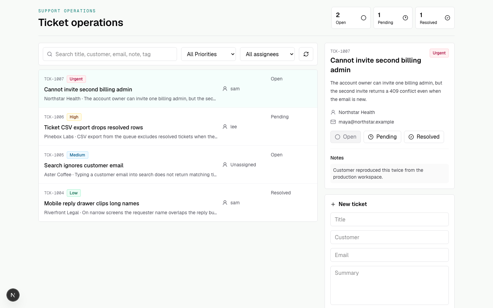
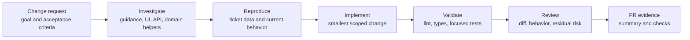

# Support Operations Workbench

A working full-stack Next.js ticket workbench for support operations and AI-assisted software delivery workflows. It provides a compact environment for understanding a change request, inspecting an existing codebase, implementing a scoped change, validating behavior, and reviewing risk.

The application uses App Router route handlers, a file-backed ticket store, a client queue UI, and TypeScript tests. AI assistance is part of the repository workflow, not a runtime product feature; this repository is not presented as a deployed AI product.



## What It Demonstrates

- A usable support queue with search, status, priority, and assignee filters.
- Ticket creation and status updates through typed route handlers.
- Shared validation and file-backed persistence with focused domain tests.
- Repository guidance for bounded, reviewable AI-assisted changes.
- A repeatable inspect, implement, validate, and diff-review workflow.

## Getting Started

First, run the development server:

```bash
npm run dev
```

Open [http://localhost:3000](http://localhost:3000) with your browser to see the result.

Useful checks:

```bash
npm run lint
npm run typecheck
npm test
npm run validate
```

## Code Map

- `src/components/ticket-workbench.tsx` - queue UI and client-side interactions.
- `src/app/api/tickets/route.ts` - list and create tickets.
- `src/app/api/tickets/[id]/route.ts` - read and update one ticket.
- `src/lib/tickets.ts` - validation, filtering, and file-backed persistence.
- `src/lib/ticket-types.ts` - browser-safe shared ticket types and constants.
- `src/data/tickets.json` - seed ticket data.
- `tests/tickets.test.ts` - focused domain tests.
- `docs/change-scenarios.md` - representative change requests and acceptance criteria.

## Ticket-to-Validation Workflow



This is the repository workflow around the application. The running workbench
itself is conventional Next.js software and does not call an AI model.

## Suggested Change Prompt

```text
Goal: implement [ticket].
Context: inspect AGENTS.md, package.json, src/lib/tickets.ts, and the relevant route/component files first.
Constraints: keep the change small, use existing helpers, avoid new production dependencies.
Done when: focused tests cover the change, npm run validate passes, and the final diff is reviewed.
First summarize the plan, then implement.
```

## Reset Seed Data

The dev app writes to `src/data/tickets.json`. Restore the seed data with Git:

```bash
git checkout -- src/data/tickets.json
```
